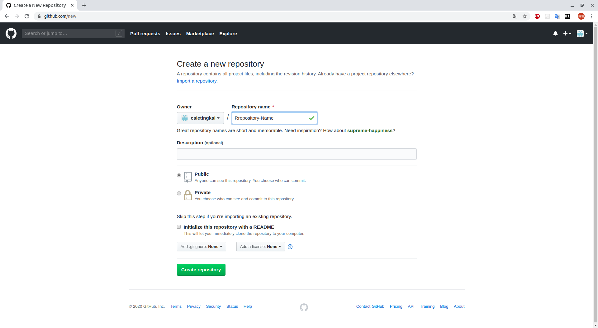

# Git

## What is Git?

Git is a distributed version control system designed to handle projects with speed and efficiency.

Git has a tiny footprint with lightning fast performance. It outclasses SCM tools like Subversion, CVS, Perforce, and ClearCase with features like cheap local branching, convenient staging areas, and multiple workflows.

## How To Install?
```sh
$ sudo apt-get install git
```
For other operating system, please checkout [official documents](https://docs.docker.com/install/)

## How To Use?

### Create Repository on GitHub
Assume you have an GitHub account, click on the green 'New' button and type the name of repository to create a new repository.


### Clone a Project
use `git-clone` clone files in repository to local directory.

```sh
git clone https://github.com/{your-github-user-name}}/{repository-name}.git
```

### Make Some Change to Project
After you have modified you files, use `git-add` to add files from working area to staging area.
```sh
git add .
// OR
git add {filename}.txt
```

Then use `git-commit` to commit files from staging area to local repository.
```sh
git commit -m "commit message type here"
```

and to change files on remote server, on this example, GitHub, use `git-push` to push the commit.
```sh
$ git push origin master
```

and open your repository url on web broswer, you will see your commit had push to remote server.

###

## Reference
+ [Git Official Website](https://git-scm.com/)
